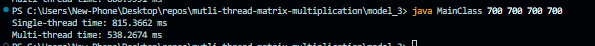
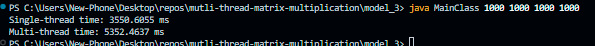
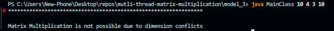

# Proje#1 Multi-threaded Matrix Multiplication
Bu repo Ondokuz Mayıs Üniversitesi Bilgisayar Mühendisliği İşletim Sistemleri Dersi Kapsamında 2023-2024 Yılı Bahar Döneminde Verilen proje1 Ödevini içermektedir.


## Ödev istenirleri
- [x] Dimensions of the two matrices are program argument inputs. 
- [x] Number of threads is also main argument of the program.
- [x] The program, first checks the arguments and matrix dimensions.
- [x] Creates the matrices with random numbers.
- [x] Then creates the threads and equally distributes the matrices among them.
- [x] Main program prints the result after calculation of all threads.
#### Bonus
- [x] Read the matrices from a text file 
- [x] Record the time for each thread and process time.

## Hareket mekanizması
Program iki matrisi **Single-thread** ve **Multi-threads** kullanaılarak çarpma işlemi yapmaktadır.


Tek bir iş parçacığıyla çarpma işlemi yapmak için `Main.java` sınıfın, `SingleThread.java` sınıfına **matrixA** ve **matrixB** nesne olarak göndererek `SingleThread.java` sınıfın içeren fojusiyonlar kullanalarak çarpma işlemi gerçekleşmektedir ve sonuç matrix `Main.java` gönderilir.

Çok iş parçacığıyla (thread sayısı **matrixA** satır sayısına kadar `rowA`) çarpma işlemi yapmak için `Main.java` sınıfın, `multiThread.java` sınıfına **matrixA** ve **matrixB** nesne olarak göndererek `multiThread.java` sınıfın içeren fojusiyonlar kullanalarak çarpma işlemi gerçekleşmektedir ve sonuç matrix `Main.java` gönderilir.

Sonuç matrix **matrixC** bulunduktan sonra `Main.java` sınıfına gelmektedir. `Main.java` sınıfı işlemi **matrixC** `writeToFile()` fonksiyonu kullanılarak, Tek iş parçacığıyla **outputPerMatrix.txt**, çok iş parçacığıyla **outputPerRow.txt** dosyalara aktarmaktadır. Tek iş parçacığıyla kaç `.ms` ve çok iş parçacığıyla her **thread** kaç `.ms` süre aldı göstermektedir. 


## BAŞLARKEN

> [!IMPORTANT]
> Uygulamayı üç durmda çalışmaktadır.
> ### Durum-1
> Programı **argumantsız** çalıştırdığınızda program otomatik olarak 5x5 boyutunda iki matris oluşturur ve **matrixA.txt**, **matrixB.txt** yazmaktadır. Sonra iki matrisi **Single-thread** ve **Multi-thread** ile çapema işlemi gerçekleştirilir.
> `javac Main.java`
> `java Main` 
> ### Durum-2
> Programı **iki argumant** almak durumnuda o iki argumant, çarpmak istediğimiz matrisleri içeren iki dosyanın adlarıdır, **matrixA.txt** ve **matrixB.txt**.
> `javac Main.java`
> `java Main matrixA.txt matrixB.txt`
> ### Durum-3
> Programı **dört argumant** almak durumnuda o dört argumant, 0. ve 1. argumant **birinci matrix'in boytu**, 2. ve 3. ise **ikinci matrix'in boyutu**. 
> `javac Main.java`
> `java Main 12 9 9 15`


## EKRAN ÇIKTISI
>[Output]
>### Test-1
>
>### Test-2
>
>### Test-2
>
>*çarpma işlemi uygun olmayan*

```
git clone
```